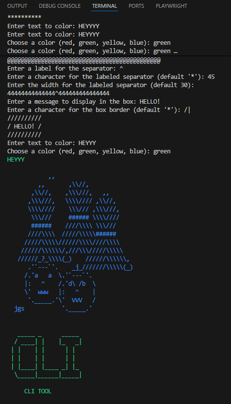

# CLI Utils
A small Python package with useful CLI tools.

## ✨ Features

- Separators
- ASCII art
- Colors

---  

## 📖 Meaning

A **Python package** is a folder of Python files that can be imported and reused in other projects. Install the package once and use it anywhere.

## ⚡ Goal

The goal of this project is to learn how to:

- Create a Python package
- Install it locally
- Share it using GitHub
- Reuse the package in other Python projects

## 🛠 Installation
Install locally:

```bash
pip install -e .
```

Install from GitHub:

```
pip install git+https://github.com/YOUR_USERNAME/cli_utils.git
```

## 🚀 Usage

```python
from cli_utils import show_banner, Colors

show_banner(Colors.GREEN)
```


## 🎯 Result


